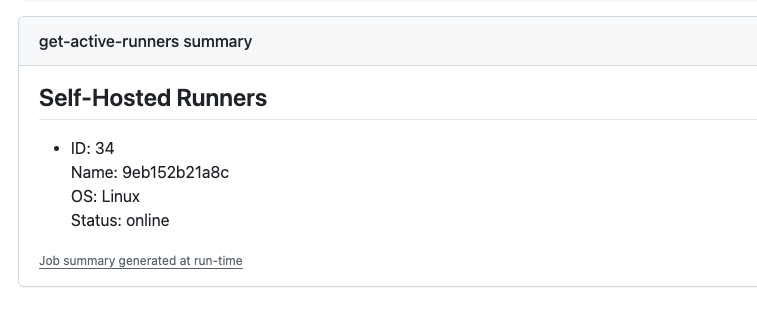
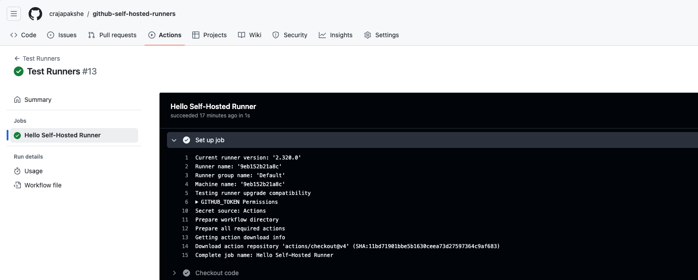
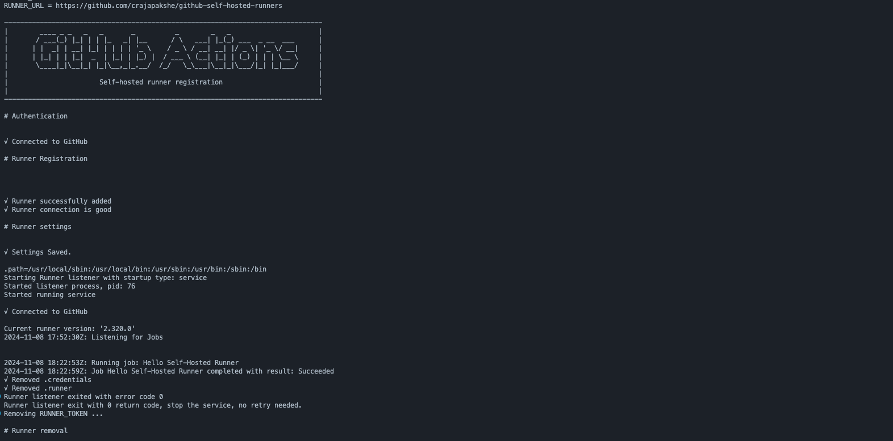
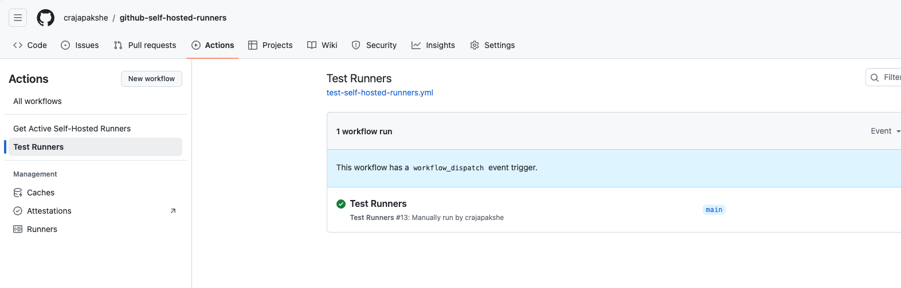

# GitHub Self-Hosted Runners

[](https://github.com/crajapakshe/github-self-hosted-runners/actions/workflows/get-active-self-hosted-runners.yml) [](https://github.com/crajapakshe/github-self-hosted-runners/actions/workflows/test-self-hosted-runners.yml)

This guide will walk you through the process of installing and configuring a Self-Hosted GitHub Actions Runner on a Docker Desktop.

### Prerequisites
- **Repository Access**: Create a GitHub Organization and fork one of your repos to it.
- **Docker Desktop**: Use either [Docker Desktop](https://docs.docker.com/desktop/) or [Docker Engine](https://docs.docker.com/engine/), based on your preference.
- **Docker Hub**: This is optional and can be used if you want to publish the image to the [Docker Hub](https://hub.docker.com/r/crajapakshe429/github-self-hosted-runners) image registry.

The following steps are taken to install a Self-Hosted GitHub Actions Runner on a Docker Desktop/Engine:

## Step 1: Build Runner Image
To create a GitHub self-hosted runner image, follow these steps:

1. **Build the Docker Image**: This step involves creating a Docker image for the GitHub runner using a specified Dockerfile. You can customize the GitHub runner version by setting the `GH_RUNNER_VERSION` build argument.
    ```bash
    docker buildx build --build-arg GH_RUNNER_VERSION=2.320.0 --provenance=true --sbom=true -t crajapakshe429/github-self-hosted-runners -f runner/runner-devops.Dockerfile ./runner/
    ```

2. **Publish the Docker Image**: Once the image is built, you can push it to a [Docker registry](https://hub.docker.com/r/crajapakshe429/github-self-hosted-runners) so that it can be reused and deployed across different environments.
    ```bash
    docker image push crajapakshe429/github-self-hosted-runners
    ```

3. **Build and Publish in One Step**: For convenience, you can combine the build and publish steps into a single command, which will build the image and push it to the Docker registry in one go.
    ```bash
    docker buildx build --build-arg GH_RUNNER_VERSION=2.320.0 --provenance=true --sbom=true -t crajapakshe429/github-self-hosted-runners -f runner/runner-devops.Dockerfile --push ./runner/
    ```
## Step 2: Runners on Docker Desktop

To run the GitHub self-hosted runner image, use the following command or use [.env.example](./runner/.env.example) to create a `.env` file and execute `docker run --rm --name github-runners --env-file runner/.env crajapakshepbl/github-runners:latest`.

    docker run --rm --name your_container_name \
           -e GITHUB_USER=your_github_user \
           -e REPO_OWNER=your_repo_owner \
           -e REPO_NAME=your_repo_name \
           -e SINGLE_USE=yep \
           -e RUNNER_LABELS=your_runner_labels \
           -e RUNNER_GROUPS=your_runner_groups \
           -e HOSTNAME=your_hostname \
           -e GITHUB_TOKEN=your_github_token \
           your_image_name

Replace the environment variables with your specific values:

- `GITHUB_USER`: Your GitHub username.
- `REPO_OWNER`: The owner of the repository where the runner will be used.
- `REPO_NAME`: The name of the repository.
- `RUNNER_LABELS`: Labels to assign to the runner.
- `RUNNER_GROUPS`: Groups to assign to the runner.
- `HOSTNAME`: The hostname for the runner.
- `your_image_name`: The name of the Docker image you built and published.

When the runners are up and running, executing the [Get Active Self-Hosted Runners](https://github.com/crajapakshe/github-self-hosted-runners/actions/workflows/get-active-self-hosted-runners.yml) action will provide a summary of active runners as shown below.




## Step 3: Configure Workflow to use a Self-Hosted Runner
Go to your repository on GitHub and modify the runner to use `self-hosted` or the `label` (e.g., `devops`) you specified in the Runner Deployment manifest. The [Test Runners](https://github.com/crajapakshe/github-self-hosted-runners/actions/workflows/test-self-hosted-runners.yml) action demonstrates how self-hosted runners can be used in GitHub workflows.

    name: Test Runners

    on:
      workflow_dispatch:

    jobs:
      test-runner:
        name: Hello Self-Hosted Runner
        runs-on: 
          labels: ["self-hosted", "devops"]
        steps:
          - name: Checkout code
            uses: actions/checkout@v4
          - name: Echo
            run: echo "Hello Self-Hosted Runner!"
    

Since the workflow above is triggered manually, trigger it and wait for the job to build.




_The Self-Hosted GitHub Runner is fully functional._
